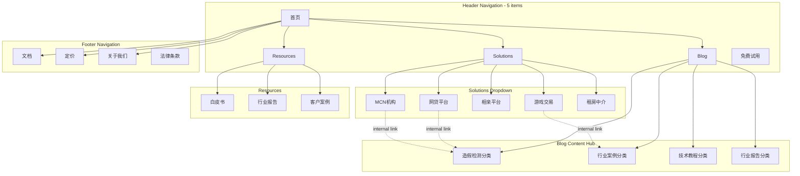

# RealCap SEO执行计划

> 目标：通过SEO获取目标行业客户（网贷平台、MCN机构、相亲平台、游戏交易平台、租房中介）
> 执行周期：6个月

---

## 一、关键词策略

### 1.1 核心关键词矩阵

#### 第一层：产品关键词（高竞争，长期目标）

| 关键词 | 搜索意图 | 优先级 | 预估难度 |
|--------|---------|--------|---------|
| 截图验证 | 产品搜索 | ⭐⭐⭐⭐ | 高 |
| 截图防伪造 | 产品搜索 | ⭐⭐⭐⭐ | 高 |
| 资产证明验证 | 产品搜索 | ⭐⭐⭐⭐ | 高 |
| 截图真实性检测 | 产品搜索 | ⭐⭐⭐ | 中 |
| 屏幕截图验证工具 | 产品搜索 | ⭐⭐⭐ | 中 |

#### 第二层：行业痛点关键词（中竞争，核心目标）

| 关键词 | 搜索意图 | 目标行业 | 优先级 |
|--------|---------|---------|--------|
| 银行余额截图造假 | 问题搜索 | 网贷平台 | ⭐⭐⭐⭐⭐ |
| 收入证明截图造假 | 问题搜索 | 网贷/租房 | ⭐⭐⭐⭐⭐ |
| 支付宝余额截图伪造 | 问题搜索 | 网贷平台 | ⭐⭐⭐⭐⭐ |
| 网红粉丝数据造假检测 | 问题搜索 | MCN机构 | ⭐⭐⭐⭐ |
| 直播收入截图造假 | 问题搜索 | MCN机构 | ⭐⭐⭐⭐ |
| 游戏账号交易截图造假 | 问题搜索 | 游戏交易 | ⭐⭐⭐⭐ |
| 租客收入证明造假 | 问题搜索 | 租房中介 | ⭐⭐⭐ |
| 相亲资料造假检测 | 问题搜索 | 相亲平台 | ⭐⭐⭐ |

#### 第三层：长尾关键词（低竞争，快速见效）

| 关键词模板 | 示例 | 目标行业 |
|-----------|------|---------|
| XX截图怎么造假 + 检测方法 | "银行流水截图怎么造假检测方法" | 网贷 |
| 如何验证XX截图真实性 | "如何验证支付宝余额截图真实性" | 网贷 |
| XX平台截图造假案例 | "网贷平台余额截图造假案例" | 网贷 |
| XX行业截图欺诈损失 | "MCN签约截图欺诈损失案例" | MCN |
| XX验证工具推荐 | "收入证明截图验证工具推荐" | 综合 |

### 1.2 关键词优先级排序

**第1个月（快速见效）**：
- 长尾关键词为主（低竞争，快速排名）
- 重点：截图造假检测方法类文章

**第2-3个月（核心攻坚）**：
- 行业痛点关键词（中竞争）
- 重点：各行业造假案例 + 解决方案

**第4-6个月（品牌建设）**：
- 产品关键词（高竞争）
- 重点：RealCap品牌词 + 产品介绍

---

## 二、内容规划

### 2.1 内容类型矩阵

| 内容类型 | 目的 | 目标关键词 | 更新频率 |
|----------|------|-----------|---------|
| 痛点文章 | 吸引搜索流量 | 行业痛点词 | 每周2篇 |
| 案例分析 | 建立专业形象 | 造假案例词 | 每周1篇 |
| 解决方案 | 转化产品介绍 | 产品词 | 每周1篇 |
| 行业报告 | 建立权威性 | 行业报告词 | 每月1篇 |
| 工具教程 | 用户教育 | 使用教程词 | 每两周1篇 |

### 2.2 每月内容产出计划

#### 第1个月：痛点切入

| 周 | 文章标题示例 | 目标关键词 | 字数 |
|----|-------------|-----------|------|
| W1 | 网贷平台余额截图造假：5种常见手法及检测方法 | 银行余额截图造假 | 2000 |
| W1 | 支付宝余额截图伪造案例分析：平台损失超百万 | 支付宝余额截图伪造 | 1500 |
| W2 | 收入证明截图造假检测：7个细节一眼识别 | 收入证明截图造假 | 2000 |
| W2 | 网贷风控必看：截图验证的3个关键技术 | 截图验证技术 | 1500 |
| W3 | MCN签约避坑：网红粉丝数据造假检测全攻略 | 网红粉丝数据造假 | 2500 |
| W3 | 直播收入截图造假：MCN机构如何识别？ | 直播收入截图造假 | 2000 |
| W4 | 游戏账号交易截图造假：买家被骗案例分析 | 游戏账号交易截图造假 | 2000 |
| W4 | RealCap截图验证工具使用教程 | 截图验证工具教程 | 1500 |

**月产出**：8篇，约15,000字

#### 第2个月：行业深入

| 周 | 文章标题示例 | 目标关键词 | 字数 |
|----|-------------|-----------|------|
| W1 | 2026年网贷风控报告：截图造假导致的坏账分析 | 网贷风控报告 | 3000 |
| W1 | 租客收入证明造假：中介机构如何有效验证？ | 租客收入证明造假 | 2000 |
| W2 | 相亲平台造假调查：资产证明截图伪造率达30% | 相亲资料造假 | 2500 |
| W2 | 银行流水截图造假技术分析：AI生成 vs 传统PS | 银行流水截图造假 | 2000 |
| W3 | MCN签约欺诈案例：网红伪造数据骗取百万签约金 | MCN签约欺诈案例 | 2000 |
| W3 | 游戏交易平台风控：如何验证卖家资产真实性？ | 游戏交易风控 | 2000 |
| W4 | 截图验证技术对比：视频验证 vs 图片验证 vs API对接 | 截图验证技术对比 | 2500 |
| W4 | RealCap产品介绍：专业的截图真实性验证服务 | RealCap产品介绍 | 1500 |

**月产出**：8篇，约17,500字

#### 第3个月：解决方案转化

| 周 | 文章标题示例 | 目标关键词 | 字数 |
|----|-------------|-----------|------|
| W1 | 网贷平台截图验证方案：降低坏账率的有效手段 | 网贷截图验证方案 | 2000 |
| W1 | MCN机构数据验证：签约前的必做检查清单 | MCN数据验证 | 2000 |
| W2 | 相亲平台实名认证升级：资产证明真实性验证 | 相亲平台认证 | 2000 |
| W2 | 游戏交易平台防骗指南：截图验证工具推荐 | 游戏交易防骗 | 2000 |
| W3 | 租房中介风控工具：租客收入证明一键验证 | 租房风控工具 | 1500 |
| W3 | 截图验证API对接指南：技术集成方案详解 | 截图验证API | 2000 |
| W4 | RealCap客户案例：某网贷平台坏账率降低20% | RealCap客户案例 | 2000 |
| W4 | 截图验证行业白皮书2026 | 截图验证白皮书 | 5000 |

**月产出**：8篇，约18,500字

#### 第4-6个月：品牌建设 + 持续优化

| 月份 | 内容重点 | 产出 |
|------|---------|------|
| M4 | 产品功能深度介绍、技术原理文章、竞品对比 | 8篇 |
| M5 | 客户成功案例、行业合作动态、媒体报道 | 8篇 |
| M6 | 年度行业报告、产品更新、SEO效果复盘 | 6篇 + 报告 |

### 2.3 内容质量标准

| 维度 | 标准 |
|------|------|
| 字数 | 痛点文章≥1500字，解决方案≥2000字，报告≥3000字 |
| 结构 | 清晰的标题层级（H2/H3）、目录导航 |
| 数据 | 每篇至少包含1个真实数据/案例引用 |
| 转化 | 每篇包含CTA（注册试用/联系客服/下载报告） |
| SEO | 关键词密度2-5%、内链3-5个、外链1-2个 |

---

## 三、技术SEO

### 3.1 网站架构与页面层级

```
Homepage (/)
├── Solutions (/solutions)
│   ├── 网贷平台方案 (/solutions/lending)
│   ├── MCN机构方案 (/solutions/mcn)
│   ├── 相亲平台方案 (/solutions/matchmaking)
│   ├── 游戏交易方案 (/solutions/gaming)
│   └── 租房中介方案 (/solutions/rental)
│
├── Blog (/blog)
│   ├── [Category: 造假检测] (/blog/fraud-detection)
│   │   ├── 银行余额截图造假识别 (/blog/detect-bank-balance-fraud)
│   │   ├── 支付宝余额伪造检测 (/blog/detect-alipay-balance-fraud)
│   │   ├── 收入证明造假识别 (/blog/detect-income-proof-fraud)
│   │   └── 直播收入截图验证 (/blog/verify-live-stream-income)
│   │
│   ├── [Category: 行业案例] (/blog/cases)
│   │   ├── 网贷平台截图欺诈案例 (/blog/lending-platform-fraud-case)
│   │   ├── MCN签约欺诈案例分析 (/blog/mcn-signing-fraud-case)
│   │   └── 游戏交易被骗真实故事 (/blog/gaming-trade-fraud-story)
│   │
│   ├── [Category: 技术教程] (/blog/tutorials)
│   │   ├── RealCap使用教程 (/blog/realcap-tutorial)
│   │   ├── API对接指南 (/blog/api-integration-guide)
│   │   └── 截图验证技术原理 (/blog/verification-technology)
│   │
│   └── [Category: 行业报告] (/blog/reports)
│       ├── 2026网贷风控报告 (/blog/2026-lending-risk-control-report)
│       └── 截图验证行业白皮书 (/blog/screenshot-verification-whitepaper)
│
├── Resources (/resources)
│   ├── 白皮书下载 (/resources/whitepaper-download)
│   ├── 行业报告 (/resources/reports)
│   ├── 检测工具清单 (/resources/fraud-detection-checklist)
│   └── 客户案例集 (/resources/case-studies)
│
├── Pricing (/pricing)
│   └── API定价 (/pricing/api)
│
├── Docs (/docs)
│   ├── 快速开始 (/docs/getting-started)
│   ├── API参考 (/docs/api)
│   │   ├── 验证接口 (/docs/api/verify)
│   │   ├── 批量验证 (/docs/api/batch-verify)
│   │   └── 回调通知 (/docs/api/callback)
│   │
│   └── 集成指南 (/docs/integration)
│       ├── Web集成 (/docs/integration/web)
│       ├── 移动端集成 (/docs/integration/mobile)
│       └── 服务端集成 (/docs/integration/server)
│
├── Compare (/compare) [新增 - 竞品对比SEO]
│   ├── vs背调公司 (/compare/background-check-services)
│   ├── vs风控平台 (/compare/risk-control-platforms)
│   └── 人工vs自动验证 (/compare/manual-vs-automated)
│
├── FAQ (/faq) [新增 - 常见问题SEO]
│   ├── 截图验证基础 (/faq/screenshot-verification-basics)
│   ├── 集成问题 (/faq/integration-questions)
│   └── 定价问题 (/faq/pricing-questions)
│
├── About (/about)
│   ├── 公司介绍 (/about)
│   ├── 技术团队 (/about/team)
│   └── 联系方式 (/about/contact)
│
└── Legal (/)
    ├── 隐私政策 (/privacy)
    └── 服务条款 (/terms)
```

### 3.2 视觉化站点地图



### 3.3 URL结构规范

#### URL设计原则

1. **人类可读** — `/solutions/lending` 不使用 `/s/l123`
2. **使用连字符** — `/blog/detect-bank-balance-fraud` 不使用 `_`
3. **反映层级结构** — URL路径与网站结构一致
4. **统一斜杠策略** — 选择一种（有或无尾部斜杠）并全局执行
5. **全小写** — `/About` 应重定向到 `/about`
6. **短且描述性** — 避免过长URL

#### URL模式表

| 页面类型 | URL模式 | 示例 |
|----------|---------|------|
| 首页 | `/` | `realcap.com` |
| 解决方案页 | `/solutions/{industry}` | `/solutions/lending` |
| 博客文章 | `/blog/{slug}` | `/blog/detect-bank-balance-fraud` |
| 博客分类 | `/blog/{category}` | `/blog/fraud-detection` |
| 资源下载 | `/resources/{type}` | `/resources/whitepaper-download` |
| 客户案例 | `/resources/case-studies/{slug}` | `/resources/case-studies/lending-platform` |
| 文档页面 | `/docs/{section}/{page}` | `/docs/api/verify` |
| 竞品对比 | `/compare/{topic}` | `/compare/background-check-services` |
| FAQ页面 | `/faq/{topic}` | `/faq/integration-questions` |
| 定价 | `/pricing` 或 `/pricing/api` | `/pricing` |
| 法律页面 | `/{page}` | `/privacy`, `/terms` |

#### URL与面包屑对齐

| URL | 面包屑 |
|-----|-----------|
| `/solutions/lending` | 首页 > Solutions > 网贷平台方案 |
| `/blog/detect-bank-balance-fraud` | 首页 > Blog > 造假检测 > 银行余额截图造假识别 |
| `/resources/whitepaper-download` | 首页 > Resources > 白皮书下载 |
| `/docs/api/verify` | 首页 > Docs > API参考 > 验证接口 |

### 3.4 页面SEO要素

| 页面类型 | Title模板 | Meta Description模板 |
|----------|----------|---------------------|
| 首页 | RealCap - 专业截图真实性验证平台 | RealCap提供专业的截图验证服务，帮助网贷平台、MCN机构等识别截图造假，降低欺诈风险。免费试用。 |
| 解决方案页 | [行业]截图验证方案 - RealCap | RealCap为[行业]提供专业截图验证方案，有效识别[行业痛点]，降低[具体损失]。查看方案详情。 |
| 博客文章 | [文章核心关键词] - RealCap博客 | [文章摘要150字，包含关键词和CTA] |
| 资源页 | [资源名称]下载 - RealCap | [资源介绍，包含关键词和价值点] |
| 竞品对比页 | RealCap vs [竞品] - 截图验证方案对比 | RealCap与[竞品]功能对比：截图验证、API对接、定价等维度详细对比，帮助您选择最适合的方案。 |
| FAQ页面 | [问题主题] - RealCap常见问题 | [问题解答摘要，包含关键词] |

### 3.5 导航设计规范

#### Header导航（5项 + CTA）

| 位置 | 项目 | 下拉菜单内容 |
|------|------|-------------|
| 1 | 首页 | — |
| 2 | Solutions▼ | 网贷平台、MCN机构、相亲平台、游戏交易、租房中介 |
| 3 | Blog▼ | 造假检测、行业案例、技术教程、行业报告 |
| 4 | Resources | — |
| 5 | Docs | — |
| 右侧 | CTA按钮 | "免费试用" (醒目色) |

**Header规则**：
- 最多4-7项（避免决策瘫痪）
- CTA按钮放最右侧
- Logo链接首页（左侧）
- 按优先级排序

#### Footer导航（4列）

```
┌─────────────┬─────────────┬─────────────┬─────────────┐
│   产品      │   资源      │   公司      │   法律      │
├─────────────┼─────────────┼─────────────┼─────────────┤
│ Solutions   │ Blog        │ 关于我们    │ 隐私政策    │
│ Pricing     │ 白皮书      │ 联系我们    │ 服务条款    │
│ API文档     │ 行业报告    │             │             │
│ 使用教程    │ 客户案例    │             │             │
└─────────────┴─────────────┴─────────────┴─────────────┘
```

#### Blog侧边栏导航

```
Blog页面侧边栏:
├── 文章分类
│   ├── 造假检测 (fraud-detection)
│   ├── 行业案例
│   ├── 技术教程
│   └── 行业报告
├── 按行业筛选
│   ├── 网贷平台
│   ├── MCN机构
│   ├── 相亲平台
│   ├── 游戏交易
│   ├── 租房中介
├── 热门文章 (Top 5)
└── 资源下载 CTA
```

#### 面包屑实施

```
首页 > Solutions > 网贷平台方案
首页 > Blog > 造假检测 > 银行余额截图造假识别
首页 > Resources > 白皮书下载
首页 > Docs > API > 验证接口
```

**实施要点**：
- 使用Schema.org BreadcrumbList标记
- 所有片段可点击（除当前页面）
- 与URL结构完全镜像
- 除首页外所有页面显示

### 3.6 内链策略

#### Hub-and-Spoke模型（内容集群）

**Hub 1: 网贷截图验证** (`/solutions/lending`)
```
Hub: /solutions/lending (网贷平台方案)
├── Spoke: /blog/detect-bank-balance-fraud (银行余额造假识别)
├── Spoke: /blog/detect-alipay-balance-fraud (支付宝伪造检测)
├── Spoke: /blog/lending-platform-fraud-case (网贷欺诈案例)
├── Spoke: /blog/lending-risk-control-tech (网贷风控技术)
└── Spoke: /resources/case-studies/lending-platform (网贷客户案例)
```

**Hub 2: MCN数据验证** (`/solutions/mcn`)
```
Hub: /solutions/mcn (MCN机构方案)
├── Spoke: /blog/detect-influencer-fraud (粉丝造假检测)
├── Spoke: /blog/verify-live-stream-income (直播收入验证)
├── Spoke: /blog/mcn-signing-fraud-case (MCN签约欺诈案例)
└── Spoke: /blog/mcn-signing-guide (MCN签约避坑指南)
```

**Hub 3: 游戏交易验证** (`/solutions/gaming`)
```
Hub: /solutions/gaming (游戏交易方案)
├── Spoke: /blog/gaming-trade-fraud (交易截图造假)
├── Spoke: /blog/gaming-trade-fraud-story (被骗案例故事)
└── Spoke: /blog/gaming-trade-risk-control (交易风控指南)
```

**Hub 4: 相亲平台验证** (`/solutions/matchmaking`)
```
Hub: /solutions/matchmaking (相亲平台方案)
├── Spoke: /blog/detect-matchmaking-fraud (资料造假检测)
└── Spoke: /blog/asset-proof-fraud-case (资产证明伪造案例)
```

**Hub 5: 租房中介验证** (`/solutions/rental`)
```
Hub: /solutions/rental (租房中介方案)
├── Spoke: /blog/detect-tenant-income-fraud (收入证明造假识别)
└── Spoke: /blog/rental-risk-control-tool (租房风控工具)
```

#### 跨区块链接机会

| 源页面 | 目标页面 | 链接场景 | 锚文本建议 |
|--------|----------|----------|-----------|
| 博客文章(痛点类) | 对应Solution页 | 文末CTA | "了解[行业]截图验证方案" |
| 博客文章(案例类) | 客户案例集 | 文中引用 | "查看更多客户案例" |
| Solution页 | 相关博客文章 | 页面底部 | "相关文章推荐" |
| Solution页 | API文档 | 功能介绍区 | "查看API对接文档" |
| Resources下载页 | Pricing | 下载后 | "查看定价方案" |
| Blog分类页 | Resources | 侧边栏 | "下载行业报告" |

#### 各关键页面内链数量建议

**首页**（最少15条内链）：
- 5个Solution页链接
- 3个Blog分类链接
- 2个Resources链接
- Pricing、Docs、About链接
- 3篇最新博客文章

**Solution页**（最少10条内链）：
- 4篇相关博客文章
- 1个客户案例
- 1个行业报告
- API文档链接
- Pricing链接
- 其他Solution页链接（行业相关）

**博客文章**（最少5-8条内链）：
- 对应Solution页链接（2次）
- 2-3篇相关文章链接
- 资源下载链接
- 其他同分类文章链接

### 3.7 技术优化清单

| 项目 | 优先级 | 完成时间 |
|------|--------|---------|
| 网站速度优化（加载<3秒） | ⭐⭐⭐⭐⭐ | W1 |
| 移动端适配（响应式设计） | ⭐⭐⭐⭐⭐ | W1 |
| HTTPS证书部署 | ⭐⭐⭐⭐⭐ | W1 |
| sitemap.xml生成提交 | ⭐⭐⭐⭐ | W2 |
| robots.txt配置 | ⭐⭐⭐⭐ | W2 |
| 结构化数据（Article/Product/BreadcrumbList） | ⭐⭐⭐ | W3 |
| Google Search Console配置 | ⭐⭐⭐⭐ | W1 |
| 百度站长平台配置 | ⭐⭐⭐⭐ | W1 |
| 404页面优化 | ⭐⭐⭐ | W4 |
| 内部链接结构优化 | ⭐⭐⭐⭐ | W2 |
| 面包屑导航实施 | ⭐⭐⭐⭐ | W2 |

---

## 四、外链建设

### 4.1 外链来源矩阵

| 外链类型 | 目标网站 | 获取方式 | 优先级 |
|----------|---------|---------|--------|
| 行业媒体投稿 | 36氪、虎嗅、钛媒体 | PR稿件投稿 | ⭐⭐⭐⭐⭐ |
| 金融科技媒体 | 未央网、零壹财经 | 行业文章投稿 | ⭐⭐⭐⭐ |
| MCN行业媒体 | 新榜、卡思数据 | 合作投稿 | ⭐⭐⭐⭐ |
| 游戏行业媒体 | 游戏陀螺、GameLook | 行业文章投稿 | ⭐⭐⭐ |
| 技术社区 | 掘金、CSDN、V2EX | 技术分享 | ⭐⭐⭐ |
| 问答平台 | 知乎、百度知道 | 问题回答 + 链接 | ⭐⭐⭐⭐ |
| 行业论坛 | 网贷之家、游戏交易论坛 | 帖子回复 + 链接 | ⭐⭐⭐ |

### 4.2 外链建设节奏

| 月份 | 外链目标 | 主要渠道 |
|------|---------|---------|
| M1 | 10条 | 知乎问答 + 技术社区 |
| M2 | 15条 | 行业媒体投稿 + 问答 |
| M3 | 20条 | 金融科技媒体 + MCN媒体 |
| M4 | 20条 | 行业论坛 + 合作媒体 |
| M5 | 25条 | 媒体报道 + 客户案例引用 |
| M6 | 15条 | 行业报告引用 + 长期维护 |

**6个月总目标**：100+高质量外链

### 4.3 知乎SEO专项

知乎是获取行业客户的最佳渠道：

| 策略 | 执行方法 |
|------|---------|
| 回答热门问题 | 搜索"截图造假"、"网贷风控"相关问题，专业回答 + 链接 |
| 创建专栏 | "截图验证技术"专栏，发布专业文章 |
| 自问自答 | 创建行业痛点问题，提供解决方案回答 |
| 私域引流 | 文章末尾引导关注公众号/访问官网 |

**目标问题列表**：
- 网贷平台如何识别借款人伪造的余额截图？
- MCN签约前如何验证网红的真实粉丝数据？
- 游戏账号交易被骗，截图造假怎么办？
- 相亲对象的资产证明截图是真的吗？
- 租客收入证明造假，中介如何验证？

---

## 五、竞品SEO分析

### 5.1 主要竞品

| 竞品 | 定位 | SEO优势 | SEO劣势 |
|------|------|---------|---------|
| 各背调公司（八方锦程等） | 综合背调服务 | 品牌知名度高 | 未专注截图验证细分 |
| 各风控服务商（同盾等） | 综合风控 | 行业覆盖广 | 截图验证非核心 |
| 各征信平台 | 综合征信 | 数据资源丰富 | 未涉及截图验证 |

**结论**：截图验证细分领域SEO竞争相对较小，有机会占据头部位置。

### 5.2 差异化SEO策略

| 维度 | RealCap策略 | 差异化点 |
|------|-------------|---------|
| 关键词 | 聚焦"截图验证"细分词 | 避开综合风控大词 |
| 内容 | 深度行业痛点内容 | 比竞品更聚焦具体问题 |
| 外链 | 行业垂直媒体 | 避开综合科技媒体竞争 |
| 转化 | 免费试用 + 行业案例 | 更直接的产品转化 |

---

## 六、执行时间表

### 6.1 月度里程碑

| 月份 | SEO里程碑 | 内容产出 | 外链数量 | 预估流量 |
|------|----------|---------|---------|---------|
| M1 | 基础搭建完成 | 8篇 | 10条 | 500UV |
| M2 | 长尾词排名进入前10 | 8篇 | 15条 | 1000UV |
| M3 | 核心词排名进入前20 | 8篇 | 20条 | 2000UV |
| M4 | 部分核心词进入前10 | 8篇 | 20条 | 3000UV |
| M5 | 核心词稳定前10 | 8篇 | 25条 | 5000UV |
| M6 | 品牌词搜索增长 | 6篇 | 15条 | 8000UV |

### 6.2 页面开发优先级

| 阶段 | 页面范围 | 完成时间 |
|------|----------|----------|
| **Phase 1** | 首页、5个Solution页、基础Blog框架 | M1-W1 |
| **Phase 2** | 首批8篇博客文章、Resources框架 | M1-W2 |
| **Phase 3** | Docs基础框架、Blog分类页完善 | M1-W3 |
| **Phase 4** | Pricing、About、Footer完整 | M1-W4 |
| **Phase 5** | FAQ页面、内链完善 | M2 |
| **Phase 6** | Compare竞品对比页、持续内容填充 | M3+ |

### 6.3 每周执行节奏

| 周工作 | 周一 | 周二 | 周三 | 周四 | 周五 |
|--------|------|------|------|------|------|
| 内容 | 选题规划 | 文章撰写 | 文章优化 | 文章发布 | 效果追踪 |
| 技术 | 监控数据 | 问题修复 | 优化迭代 | 测试验证 | 报告汇总 |
| 外链 | 渠道筛选 | 内容准备 | 投稿发布 | 跟进回复 | 链接验证 |
| 分析 | 流量分析 | 排名监控 | 竞品追踪 | 转化分析 | 周报汇总 |

---

## 七、流量转化漏斗

### 7.1 转化路径设计

```
SEO流量 → 博客文章 → 痛点共鸣 → 了解方案 → 产品页 → 注册试用 → 成交
          ↓                    ↓
          资源下载（获取邮箱）    钉钉/微信咨询
```

### 7.2 各页面转化目标

| 页面 | 转化目标 | CTA设计 |
|------|---------|---------|
| 博客文章 | 跳转产品页 / 下载资源 | "免费试用"按钮 + "下载报告"表单 |
| 解决方案页 | 注册试用 / 联系咨询 | "立即试用"按钮 + 咨询表单 |
| 资源页 | 获取邮箱 | 下载表单（邮箱必填） |
| 首页 | 注册试用 | 主CTA按钮 + 特性介绍 |

### 7.3 转化率目标

| 流量来源 | 访问→注册 | 注册→试用 | 试用→成交 |
|----------|---------|---------|---------|
| SEO博客流量 | 5% | 30% | 10% |
| SEO产品页流量 | 15% | 50% | 20% |
| SEO资源下载流量 | 20%（邮箱获取） | 40% | 15% |

**6个月转化目标**：
- SEO流量：8000UV/月
- 注册用户：400人/月
- 试用用户：120人/月
- 成交客户：12人/月

---

## 八、SEO效果追踪

### 8.1 核心指标

| 指标类型 | 具体指标 | 目标工具 |
|----------|---------|---------|
| 流量指标 | UV、PV、跳出率、停留时间 | Google Analytics |
| 排名指标 | 核心关键词排名位置 | Ahrefs / SEMrush |
| 外链指标 | 外链数量、质量、来源 | Ahrefs / Moz |
| 转化指标 | 注册数、试用数、成交数 | CRM系统 |
| 内容指标 | 文章收录数、排名数 | Search Console |

### 8.2 周报模板

```
SEO周报：
1. 流量数据：本周UV___，较上周___%
2. 排名变化：核心词排名___，新增排名词___个
3. 内容产出：发布文章___篇，收录___篇
4. 外链建设：新增外链___条，来源___
5. 转化数据：注册___人，试用___人
6. 下周计划：___
```

### 8.3 月度复盘

| 复盘维度 | 分析内容 |
|----------|---------|
| 流量分析 | 各渠道流量占比、增长趋势 |
| 排名分析 | 关键词排名变化、机会词发现 |
| 内容分析 | 高流量文章、高转化文章、待优化文章 |
| 外链分析 | 高质量外链、失效外链、新机会渠道 |
| 转化分析 | 各环节转化率、漏斗流失点 |
| 下月规划 | 调整关键词、内容主题、外链策略 |

---

## 九、预算估算

### 9.1 人力成本

| 角色 | 工作内容 | 投入时间 | 预估成本 |
|------|---------|---------|---------|
| SEO专员 | 关键词研究、排名监控、技术优化 | 20h/周 | 8000元/月 |
| 内容编辑 | 文章撰写、优化、发布 | 20h/周 | 6000元/月 |
| 技术支持 | 网站优化、页面开发 | 5h/周 | 兼职/内部 |

### 9.2 工具成本

| 工具 | 用途 | 成本 |
|------|------|------|
| Ahrefs / SEMrush | 关键词研究、排名监控、外链分析 | $99/月 |
| Google Analytics | 流量分析 | 免费 |
| Search Console | 收录监控 | 免费 |
| 百度站长平台 | 百度收录监控 | 免费 |

### 9.3 外链/推广成本

| 项目 | 成本估算 |
|------|---------|
| 媒体投稿（部分需要付费） | 3000-5000元/月 |
| 知乎推广（可选） | 2000元/月 |
| 其他渠道 | 2000元/月 |

### 9.4 总预算

| 月份 | 人力 | 工具 | 推广 | 合计 |
|------|------|------|------|------|
| M1-3 | 14000 | 700 | 7000 | 21700元/月 |
| M4-6 | 14000 | 700 | 5000 | 19700元/月 |

**6个月总预算**：约12万元

---

## 十、风险与应对

| 风险 | 可能性 | 影响 | 应对措施 |
|------|--------|------|---------|
| 关键词排名不及预期 | 中 | 流量目标不达标 | 加大内容产出、外链建设 |
| 内容产出质量不足 | 中 | 用户粘性差 | 建立内容质量审核机制 |
| 外链获取困难 | 中 | 排名提升慢 | 多渠道并行、增加知乎投入 |
| 算法更新影响 | 低 | 排名波动 | 持续关注算法动态、合规SEO |
| 竞品加大SEO投入 | 中 | 竞争加剧 | 差异化关键词、内容深度 |

---

## 附录：第1月详细执行清单

### W1执行清单

| 任务 | 具体内容 | 负责人 | 完成标准 |
|------|---------|--------|---------|
| 关键词研究 | 完成50个目标关键词列表 | SEO | 包含搜索量、竞争度 |
| 网站技术检查 | 速度、移动端、HTTPS | 技术 | 通过检测工具 |
| Search Console配置 | Google + 百度 | SEO | 验证成功 |
| 第1篇文章选题 | 确定8篇文章标题 | 内容 | 符合关键词策略 |
| 知乎账号准备 | 注册 + 专栏创建 | SEO | 专栏可发布 |
| **首页开发** | Hero、Features、CTA区块 | 技术 | 页面可用 |
| **Solution页框架** | 5个行业方案页骨架 | 技术 | 页面可访问 |

### W2执行清单

| 任务 | 具体内容 | 负责人 | 完成标准 |
|------|---------|--------|---------|
| 发布第1-2篇文章 | 网贷造假相关 | 内容 | 收录成功 |
| sitemap生成提交 | 生成 + 提交搜索引擎 | SEO | 提交成功 |
| 内链结构设计 | 规划文章间链接关系 | SEO | 结构图完成 |
| 知乎回答3个问题 | 网贷/MCN相关问题 | SEO | 回答发布 |
| 技术优化检查 | robots.txt、404页 | 技术 | 配置完成 |
| **面包屑实施** | Schema标记 + HTML结构 | 技术 | 所有页面有面包屑 |
| **Blog分类页** | 4个分类页开发 | 技术 | 分类页可用 |

### W3执行清单

| 任务 | 具体内容 | 负责人 | 完成标准 |
|------|---------|--------|---------|
| 发布第3-5篇文章 | MCN/游戏交易相关 | 内容 | 收录成功 |
| 知乎回答3个问题 | 游戏/相亲相关问题 | SEO | 回答发布 |
| 结构化数据配置 | Article/Product/BreadcrumbList Schema | 技术 | 配置完成 |
| 外链渠道筛选 | 确定10个目标渠道 | SEO | 渠道列表完成 |
| 排名初步检查 | 检查已发布文章排名 | SEO | 记录排名数据 |
| **Docs框架** | API文档页骨架 | 技术 | 文档页可访问 |

### W4执行清单

| 任务 | 具体内容 | 负责人 | 完成标准 |
|------|---------|--------|---------|
| 发布第6-8篇文章 | 教程/产品介绍 | 内容 | 收录成功 |
| 知乎回答3个问题 | 综合/租房相关问题 | SEO | 回答发布 |
| 外链投稿准备 | 准备投稿稿件 | SEO | 稿件完成 |
| 月度复盘 | 流量/排名/内容分析 | SEO | 复盘报告完成 |
| 下月规划 | 确定M2执行计划 | SEO | 计划确认 |
| **Pricing/About页** | 定价、关于页面开发 | 技术 | 页面完整 |
| **Footer完整** | 4列导航 + 链接 | 技术 | Footer可用 |